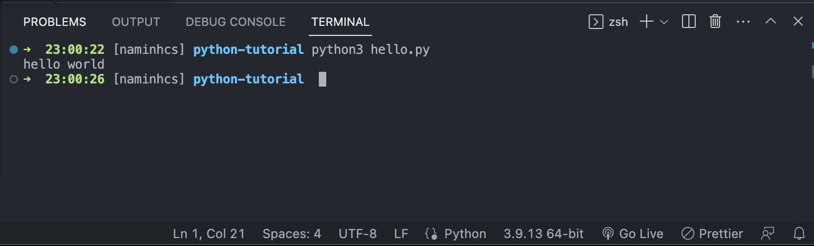

### Setup Enviroment
IDE: [Visual studio code](https://code.visualstudio.com/). Highly recommand this

How to install python3 in vscode. [Click here](https://www.youtube.com/watch?v=veJvQ88ULOM)

If you get any problem, let me know.

### First program

You can create a folder that contains your code then open it by vscode. After that open terminal (control + shilf + `), you can see terminal in bottom.

Create new file (.py): **hello.py**. Then copy this to **hello.py**

```python
print("Hello world")
```

Press command + s to save file


Run program:

```
python3 file_name.py
```

To run **hello.py**

```
python3 hello.py
```

output:


### Data type

### Data type advance

### operator

### Python variable

### Block code

### Loop

### If/else

### file
