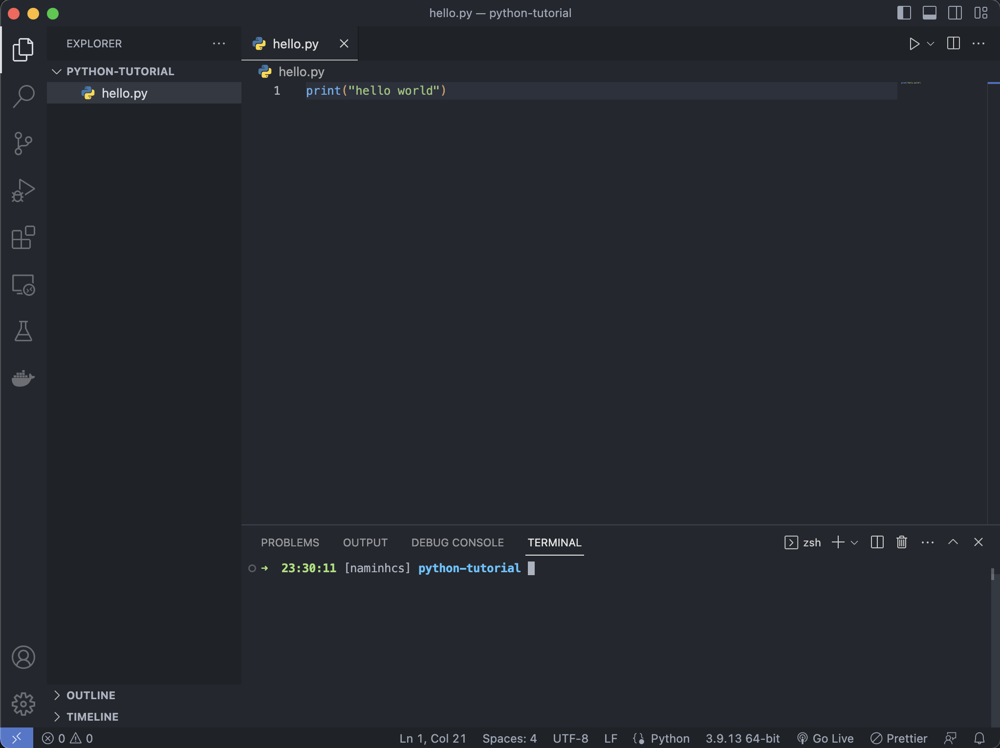

### Setup Enviroment
IDE: [Visual studio code](https://code.visualstudio.com/). Highly recommand this

How to install python3 in vscode. [Click here](https://www.youtube.com/watch?v=veJvQ88ULOM)

If you get any problem, let me know.

### First program

You can create a folder that contains your code then open it by vscode. After that open terminal (control + shilf + `), you can see terminal in bottom.

Create new file (.py): **hello.py**. Then copy this to **hello.py**

```python
print("Hello world")
```

Press command + s to save file



Run program:

```
python3 file_name.py
```

To run **hello.py**

```
python3 hello.py
```

output:


### Data type
In python, you don't need to define type of variable

| Example | Type |
| ------- | ------- |
| x = 25 | int |
| x = "Hello World" | str |
| x = 2.5 | float |
| x = True | bool |

bool type has only 2 value: "True/False"

### Data type advance

#### List
List is a type that you can contains multiple value

Example:

```python
list = [1, "2", 3.3, True] # it can contains different type
```
**Access item**
List items are indexed (start index = 0) and you can access it by referring by index number:

```python
list = [1, "2", 3.3, True]
print(list[0]) # it will be 1
print(list[3]) # it will be True
```

**Change item**
You can change value of item
```python
list[0] = 2 # change value of item 0
list[1:3] = ["3", False] # change value of item 1 and 3
```

**Append**
You add the item to the end of list
```python
list.append("Add item")
print(list)
```

**Remove the item**

```python
list = [1, "2", 3.3, True]
list.remove(1) # remove item = 1 (first item from left to right)
list.pop() # remove item of the end of list
list.del(1) # remove specific index item
```

### operator

### Python variable

### Block code

### Loop

### If/else

### file
