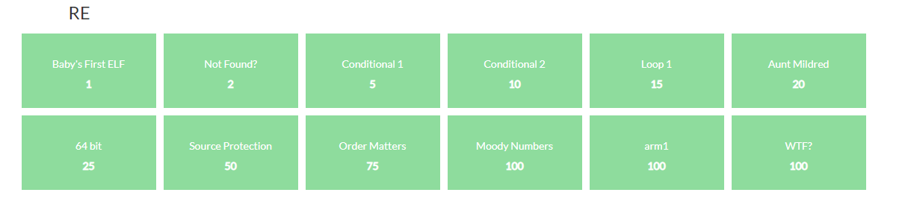
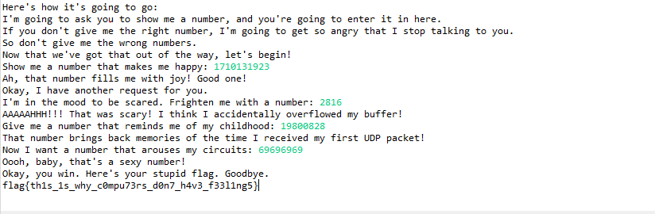
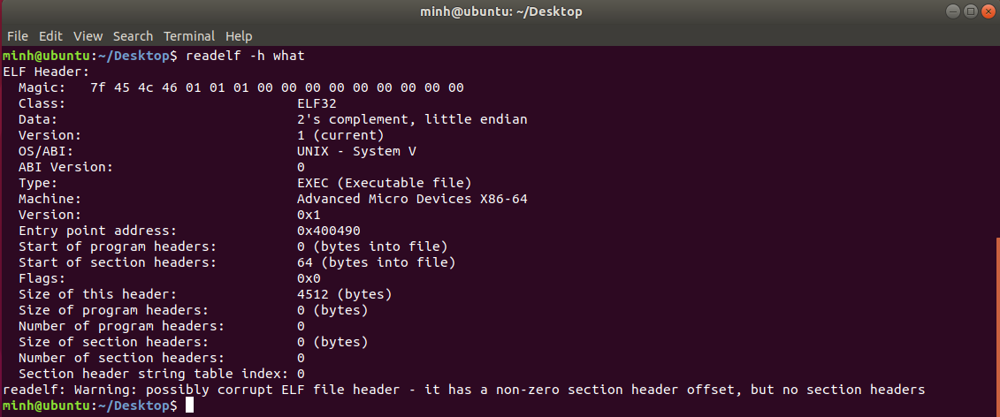
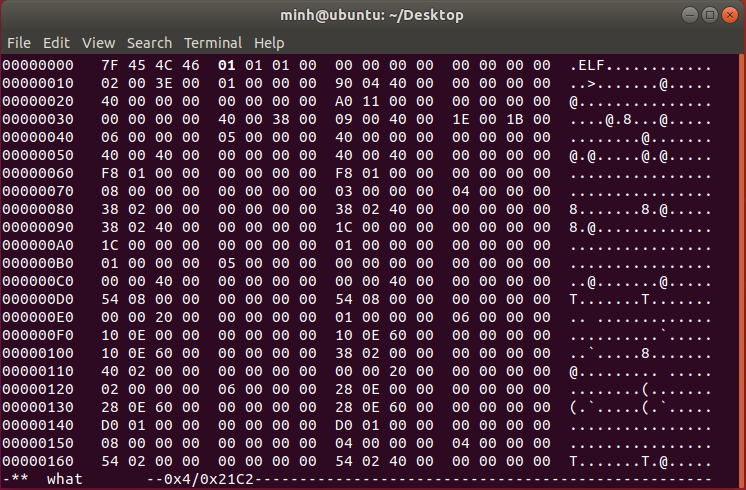
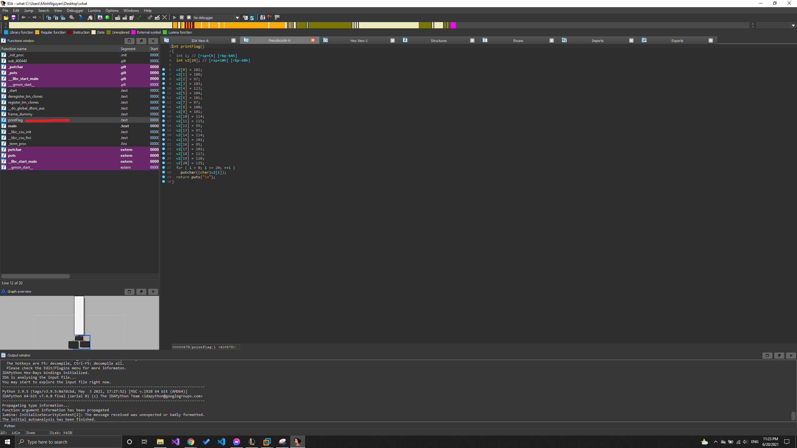

### Result

Kết quả đạt được tổng điểm là 503 điểm phần RE.

### Conditional1

Ta mở file bằng IDA, ta sẽ thu được code như sau:

```c
int __cdecl main(int argc, const char **argv, const char **envp)
{
  int result; // eax

  if ( argc == 2 )
  {
    if ( !strcmp(argv[1], "super_secret_password") )
    {
      puts("Access granted.");
      giveFlag();
      result = 0;
    }
    else
    {
      puts("Access denied.");
      result = 1;
    }
  }
  else
  {
    printf("Usage: %s password\n", *argv);
    result = 1;
  }
  return result;
}
```
Hàm sẽ nhận vào 1 string và so sánh với string **super_secret_password**. Nếu đúng thì sẽ in ra flag. Chạy chương trình và truyền vào string trên ta thu được flag như sau
FLAG
```
flag{if_i_submit_this_flag_then_i_will_get_points}
```

### loop1
Ta decompile file loop1 bằng IDA. Ta sẽ có đoạn code sau:

```c
int __cdecl main(int argc, const char **argv, const char **envp)
{
  __int64 v4[12]; // [rsp+0h] [rbp-70h] BYREF
  int v5; // [rsp+60h] [rbp-10h]
  unsigned int v6; // [rsp+64h] [rbp-Ch] BYREF
  unsigned int v7; // [rsp+68h] [rbp-8h] BYREF
  unsigned int v8; // [rsp+6Ch] [rbp-4h] BYREF

  while ( 1 )
  {
    while ( 1 )
    {
      puts("Menu:\n\n[1] Say hello\n[2] Add numbers\n[3] Quit");
      printf("\n[>] ");
      if ( (unsigned int)__isoc99_scanf("%u", &v8) != 1 )
      {
        puts("Unknown input!");
        return 1;
      }
      if ( v8 != 1 )
        break;
      printf("What is your name? ");
      v4[0] = 0LL;
      v4[1] = 0LL;
      v4[2] = 0LL;
      v4[3] = 0LL;
      v4[4] = 0LL;
      v4[5] = 0LL;
      v4[6] = 0LL;
      v4[7] = 0LL;
      v4[8] = 0LL;
      v4[9] = 0LL;
      v4[10] = 0LL;
      v4[11] = 0LL;
      v5 = 0;
      if ( (unsigned int)__isoc99_scanf("%99s", v4) != 1 )
      {
        puts("Unable to read name!");
        return 1;
      }
      printf("Hello, %s!\n", (const char *)v4);
    }
    if ( v8 != 2 )
      break;
    printf("Enter first number: ");
    if ( (unsigned int)__isoc99_scanf("%d", &v7) != 1
      || (printf("Enter second number: "), (unsigned int)__isoc99_scanf("%d", &v6) != 1) )
    {
      puts("Unable to read number!");
      return 1;
    }
    printf("%d + %d = %d\n", v7, v6, v7 + v6);
  }
  if ( v8 == 3 )
  {
    puts("Goodbye!");
  }
  else if ( v8 == 31337 )
  {
    puts("Wow such h4x0r!");
    giveFlag();
  }
  else
  {
    printf("Unknown choice: %d\n", v8);
  }
  return 0;
}
```
Dễ dàng nhận thấy rằng chương trình bắt nhập vào 1 số **v8**, nếu số này **v8 == 31337** thì sẽ được gọi hàm **giveFlag**

Sau khi chạy chương trình và nhập số **31337** ta sẽ thu được flag như sau:
FLAG
```
flag{much_reversing_very_ida_wow}
```
### conditional2
Mở file bằng IDA ta sẽ có hàm main như sau:
```c
int __cdecl main(int argc, const char **argv, const char **envp)
{
  int result; // eax

  if ( argc == 2 )
  {
    if ( atoi(argv[1]) == -889262067 )
    {
      puts("Access granted.");
      giveFlag();
      result = 0;
    }
    else
    {
      puts("Access denied.");
      result = 1;
    }
  }
  else
  {
    printf("Usage: %s password\n", *argv);
    result = 1;
  }
  return result;
}
```
Dễ dàng thấy được chương trình nhận vào 1 số nguyên và số đó **-889262067** thì sẽ in ra flag. Ta chạy chương trình và truyền vào số đó sẽ thu được flag như sau:
FLAG
```
flag{at_least_this_cafe_wont_leak_your_credit_card_numbers}
```
### Aunt Mildred
Mở file bằng IDA, ta sẽ được hàm main như sau:

```c
int __cdecl main(int a1, char **a2)
{
  const char *v2; // edi
  size_t v3; // eax
  const char *v4; // esi
  size_t v5; // eax

  if ( a1 == 2 )
  {
    v2 = a2[1];
    v3 = strlen(v2);
    v4 = (const char *)malloc(2 * v3);
    if ( v4 )
    {
      v5 = strlen(v2);
      sub_80486B0(v2, v4, v5, 0);
      if ( strlen(v4) == 64 && !strcmp(v4, "ZjByX3kwdXJfNWVjMG5kX2xlNTVvbl91bmJhc2U2NF80bGxfN2gzXzdoMW5nNQ==") )
      {
        puts("Correct password!");
        return 0;
      }
      puts("Come on, even my aunt Mildred got this one!");
    }
    else
    {
      fwrite("malloc failed\n", 0xEu, 1u, stderr);
    }
  }
  else
  {
    fprintf(stderr, "Usage: %s PASSWORD\n", *a2);
  }
  return -1;
}
```
Thấy rằng sau khi **v2** được đi qua hàm **sub_80486B0** và compare với **ZjByX3kwdXJfNWVjMG5kX2xlNTVvbl91bmJhc2U2NF80bGxfN2gzXzdoMW5nNQ** thì sẽ đúng password.
Mở hàm **sub_80486B0** ta sẽ có code như sau:
```c
int __cdecl sub_80486B0(int a1, int a2, unsigned int a3, int a4)
{
  int v5; // [esp+18h] [ebp-2Ch]
  unsigned int v6; // [esp+1Ch] [ebp-28h]
  unsigned int v7; // [esp+24h] [ebp-20h]
  int v8; // [esp+28h] [ebp-1Ch]
  unsigned int v9; // [esp+2Ch] [ebp-18h]

  v5 = 0;
  v7 = a3 / 3;
  v6 = a3 % 3;
  if ( a2 )
  {
    v9 = 0;
    v8 = 0;
    while ( v9 < 3 * v7 )
    {
      *(_BYTE *)(a2 + v8) = byte_8048F1C[*(unsigned __int8 *)(a1 + v9) >> 2];
      *(_BYTE *)(v8 + a2 + 1) = byte_8048F1C[(16 * (*(_BYTE *)(a1 + v9) & 3)) | (*(unsigned __int8 *)(a1 + v9 + 1) >> 4)];
      *(_BYTE *)(v8 + a2 + 2) = byte_8048F1C[(4 * (*(_BYTE *)(v9 + a1 + 1) & 0xF)) | (*(unsigned __int8 *)(v9 + a1 + 2) >> 6)];
      *(_BYTE *)(v8 + a2 + 3) = byte_8048F1C[*(_BYTE *)(v9 + a1 + 2) & 0x3F];
      if ( !((v8 - v5 + 4) % 0x4Cu) && a4 )
      {
        *(_BYTE *)(a2 + v8++ + 4) = 10;
        ++v5;
      }
      v9 += 3;
      v8 += 4;
    }
    if ( v6 == 1 )
    {
      *(_BYTE *)(a2 + v8) = byte_8048F1C[(int)*(unsigned __int8 *)(a1 + v9) >> 2];
      *(_BYTE *)(a2 + v8 + 1) = byte_8048F1C[16 * (*(_BYTE *)(a1 + v9) & 3)];
      *(_BYTE *)(a2 + v8 + 2) = 61;
      *(_BYTE *)(a2 + v8 + 3) = 61;
      v8 += 4;
    }
    else if ( v6 == 2 )
    {
      *(_BYTE *)(a2 + v8) = byte_8048F1C[(int)*(unsigned __int8 *)(a1 + v9) >> 2];
      *(_BYTE *)(a2 + v8 + 1) = byte_8048F1C[(16 * (*(_BYTE *)(a1 + v9) & 3)) | ((int)*(unsigned __int8 *)(a1 + v9 + 1) >> 4)];
      *(_BYTE *)(a2 + v8 + 2) = byte_8048F1C[4 * (*(_BYTE *)(a1 + v9 + 1) & 0xF)];
      *(_BYTE *)(a2 + v8 + 3) = 61;
      v8 += 4;
    }
  }
  else
  {
    v8 = 4 * v7;
    if ( v6 )
      v8 += 4;
    if ( a4 )
      v8 += a3 / 0x39;
  }
  return v8;
}
```
Hàm này rất giống với encrypt base64. Ta thử decrypt xâu **ZjByX3kwdXJfNWVjMG5kX2xlNTVvbl91bmJhc2U2NF80bGxfN2gzXzdoMW5nNQ**. Sau khi decrypt ta sẽ thu được: f0r_y0ur_5ec0nd_le55on_unbase64_4ll_7h3_7h1ng5 
Thử chạy chương trình với xâu này thì đây chính là password.
FLAG
```
flag{f0r_y0ur_5ec0nd_le55on_unbase64_4ll_7h3_7h1ng5}
```

### 64bit
Mở file bằng IDA, ta có được hàm main như sau:

```c
int __cdecl main(int argc, const char **argv, const char **envp)
{
  int v4; // [rsp+8h] [rbp-8h] BYREF
  int v5; // [rsp+Ch] [rbp-4h]

  v4 = 0;
  puts("enter key:");
  __isoc99_scanf("%d", &v4);
  v5 = encrypt(v4);
  if ( v5 == -559038737 )
    puts("win :)");
  else
    puts("try again ");
  return 0;
}
```

Dễ dàng nhận thấy được **v5 = encrypt(v4)** và **v5 == -559038737** thì sẽ đúng password. Đi vào hàm encrypt ta có đoạn code như sau:

```c
__int64 __fastcall encrypt(int a1)
{
  return a1 ^ 1234u;
}
```
Đây chỉ là 1 phép xor đơn giản như sau: **a1 ^ 1234 = -559038737**. Chính vì vậy ta có thể dễ dàng tìm được **a1 = -559038737 ^ 1234**.
Ta sẽ tìm được **a1 = 3735927357**
FLAG
```
flag{3735927357}
```

### Source Protection
Bài này là được compile từ python. Ta sẽ sử dụng các tool để decompile file này ra code python. Sau khi decompile ta sẽ nhận được file python với code như sau:

```python
# uncompyle6 version 2.11.5
# Python bytecode 2.7 (62211)
# Decompiled from: Python 2.7.17 (default, Feb 27 2021, 15:10:58) 
# [GCC 7.5.0]
# Embedded file name: passwords.py


def main():
    passwords = {'Facebook': 'Zuck3rb3rg_is_dr34my','Twitter': 'SwiftOnSecurity15l1f3',
       'School': 'I_Before_E_Except_After_C',
       'SunshineCTF': 'sun{py1n574ll3r_15n7_50urc3_pr073c710n}'
       }
    print 'Welcome to my super secret password vault!'
    p = raw_input("What's the magic phrase?: ")
    if p != "I hate when I'm on a flight and I wake up with a water bottle next to me like oh great now I gotta be responsible for this water bottle - Kanye West":
        print 'Wrong!'
    else:
        print 'Welcome back! Here are your passwords...'
        for k, v in passwords.iteritems():
            print 'Site: {}, Password: {}'.format(k, v)

    raw_input('Press enter to exit...')


if __name__ == '__main__':
    main()
```
Dề dàng nhận ra flag chính là **sun{py1n574ll3r_15n7_50urc3_pr073c710n}**
FLAG
```
sun{py1n574ll3r_15n7_50urc3_pr073c710n}
```
### Order Matters
Mở file bằng IDA ta có hàm main như sau:
```c
int __cdecl main(int argc, const char **argv, const char **envp)
{
  int result; // eax
  __int64 v4[7]; // [rsp+0h] [rbp-70h]
  int v5; // [rsp+38h] [rbp-38h]
  char s[36]; // [rsp+40h] [rbp-30h] BYREF
  int v7; // [rsp+64h] [rbp-Ch]
  int v8; // [rsp+68h] [rbp-8h]
  int i; // [rsp+6Ch] [rbp-4h]

  v4[0] = 0LL;
  v4[1] = 0LL;
  v4[2] = 0LL;
  v4[3] = 0LL;
  v4[4] = 0LL;
  v4[5] = 0LL;
  v4[6] = 0LL;
  v5 = 0;
  i = 0;
  v8 = 0;
  v7 = 0;
  printf("Enter password: ");
  __isoc99_scanf("%s", s);
  if ( strlen(s) != 30 )
  {
    puts("Wrong password length.");
    exit(-1);
  }
  for ( i = 0; i <= 14; ++i )
  {
    *((_DWORD *)v4 + i) += 10 * (s[v8] - 48);
    *((_DWORD *)v4 + i) += s[v8 + 1] - 48;
    v8 += 2;
  }
  for ( i = 0; i <= 14; ++i )
  {
    switch ( *((_DWORD *)v4 + i) )
    {
      case 1:
        v7 += p01();
        break;
      case 2:
        v7 -= p02();
        break;
      case 3:
        v7 *= (unsigned int)p03();
        break;
      case 4:
        v7 += p04();
        break;
      case 5:
        v7 -= p05();
        break;
      case 6:
        v7 *= (unsigned int)p06();
        break;
      case 7:
        v7 += p07();
        break;
      case 8:
        v7 -= p08();
        break;
      case 9:
        v7 *= (unsigned int)p09();
        break;
      case 0xA:
        v7 += p10();
        break;
      case 0xB:
        v7 -= p11();
        break;
      case 0xC:
        v7 *= (unsigned int)p12();
        break;
      case 0xD:
        v7 += p13();
        break;
      case 0xE:
        v7 -= p14();
        break;
      case 0xF:
        v7 *= (unsigned int)p15();
        break;
      default:
        continue;
    }
  }
  if ( abs32(v7) == 1865295194 )
    result = puts("Access Granted");
  else
    result = puts("Access Denied.");
  return result;
}
```
Dễ dàng hiểu được chương trình sẽ nhận vào 1 string độ dài 30, sau đó cứ với 2 kí tự của string ta sẽ ra được 1 số nguyên. Ứng với mỗi số nguyên sẽ là 1 case trong switch. Ta thử xem hàm **p01()** sẽ làm gì. Mở code của hàm **p01()** ta có:

```c
__int64 p01()
{
  return strtol("58335249", 0LL, 16);
}
```
Hàm này đưa ta 1 string và chuyển về hệ 16. Tương tự với các hàm khác, mỗi hàm sẽ cung cấp cho ta 1 số nguyên. Ta thấy, khi ghép các số hệ 16 này lại thì rất giống với xâu sau khi được encrypt base64. Xâu khi ta ghép lại là **X3RIX0lEZ1Nfc3VuX1QwQV9iNHJEfTNfeWExMTNfQjB5c3ttWV9UaFIxbg==**. Sau khi decrypt ta thu được xâu như sau: **__tH_IDgS_sun_T0A_b4rD}3_ya113_B0ys{mY_ThR1n**. Nó rất giống với flag nhưng đã bị thay đổi vị trí. Ta hoán vị xâu này thì nhận được flag như sau:
FLAG
```
sun{mY_IDA_bR1ngS_a11_Th3_B0ys_t0_tH3_y4rD}
```
### Moody Number

Do file này được biên dịch từ java. Vì vậy ta sử dụng các tool để decompile file jar này. Sau khi decompile ta được 2 file sau:

NumberChecker.java
~~~
import java.math.BigInteger;
import java.security.MessageDigest;

// 
// Decompiled by Procyon v0.5.36
// 

public class NumberChecker
{
    public boolean isHappy(int n) {
        if (n % 270719 != 0) {
            return false;
        }
        n /= 270719;
        return n == 6317;
    }
    
    public boolean isScary(final int n) {
        return (n & 0xFF) == 0x0 && n >> 12 == 0 && (n >> 8 ^ 0xF) == 0x4;
    }
    
    public boolean isNostalgic(final int i) {
        try {
            return String.format("%032x", new BigInteger(1, MessageDigest.getInstance("MD5").digest(Integer.toString(i).getBytes("UTF-8")))).equals("08ef85248841b7fbf4b1ef8d1090a0d4");
        }
        catch (Exception obj) {
            System.out.println("An error occurred: " + obj);
            return false;
        }
    }
    
    public boolean isArousing(int n) {
        final int n2 = n % 10;
        n /= 10;
        final int n3 = n % 10;
        n /= 10;
        if (n3 % 2 != 0) {
            return false;
        }
        if (n2 != n3 / 2 * 3) {
            return false;
        }
        for (int i = 0; i < 3; ++i) {
            if (n % 10 != n2) {
                return false;
            }
            n /= 10;
            if (n % 10 != n3) {
                return false;
            }
            n /= 10;
        }
        return n == 0 && n2 % 2 != 0 && (n2 ^ n3) == 0xF;
    }
}
~~~
MoodyNumbers.java
~~~
import java.security.Key;
import javax.crypto.Cipher;
import javax.crypto.spec.SecretKeySpec;
import java.nio.ByteBuffer;
import java.util.Scanner;

// 
// Decompiled by Procyon v0.5.36
// 

class MoodyNumbers
{
    public static void main(final String[] array) {
        final Scanner scanner = new Scanner(System.in);
        final NumberChecker numberChecker = new NumberChecker();
        System.out.println("Greetings, human! I am the Moody Number Bot.");
        sleep(1000);
        System.out.println("We're going to play a little game.");
        sleep(1000);
        System.out.println("Here's how it's going to go:");
        sleep(1000);
        System.out.println("I'm going to ask you to show me a number, and you're going to enter it in here.");
        sleep(1000);
        System.out.println("If you don't give me the right number, I'm going to get so angry that I stop talking to you.");
        sleep(1000);
        System.out.println("So don't give me the wrong numbers.");
        sleep(1000);
        System.out.println("Now that we've got that out of the way, let's begin!");
        sleep(1000);
        System.out.print("Show me a number that makes me happy: ");
        final int nextInt = scanner.nextInt();
        if (!numberChecker.isHappy(nextInt)) {
            wrongNumber("THAT NUMBER DOES NOT MAKE ME HAPPY!!!");
        }
        System.out.println("Ah, that number fills me with joy! Good one!");
        sleep(1000);
        System.out.println("Okay, I have another request for you.");
        sleep(1000);
        System.out.print("I'm in the mood to be scared. Frighten me with a number: ");
        final int nextInt2 = scanner.nextInt();
        if (!numberChecker.isScary(nextInt2)) {
            wrongNumber("IS THAT THE BEST YOU HAVE? THAT COULDN'T SCARE AN INFANT!!!");
        }
        System.out.println("AAAAAHHH!!! That was scary! I think I accidentally overflowed my buffer!");
        sleep(1000);
        System.out.print("Give me a number that reminds me of my childhood: ");
        final int nextInt3 = scanner.nextInt();
        if (nextInt3 == 0) {
            wrongNumber("HOW DARE YOU INSULT MY CHILDHOOD!!!");
        }
        else if (!numberChecker.isNostalgic(nextInt3)) {
            wrongNumber("THIS NUMBER REMINDS ME OF THE TIME A MEAN HACKER ALMOST FRIED MY CIRCUITS, NOT MY CHILDHOOD!!!");
        }
        System.out.println("That number brings back memories of the time I received my first UDP packet!");
        sleep(1000);
        System.out.print("Now I want a number that arouses my circuits: ");
        final int nextInt4 = scanner.nextInt();
        if (!numberChecker.isArousing(nextInt4)) {
            wrongNumber("THAT NUMBER IS SUCH A TURN-OFF THAT IT DISABLED MY NETWORK ADAPTER!!!");
        }
        System.out.println("Oooh, baby, that's a sexy number!");
        sleep(1000);
        System.out.println("Okay, you win. Here's your stupid flag. Goodbye.");
        sleep(1000);
        System.out.println(getFlag(nextInt, nextInt3, nextInt2, nextInt4));
        scanner.close();
    }
    
    static void sleep(final int n) {
        try {
            Thread.sleep(n);
        }
        catch (InterruptedException ex) {}
    }
    
    static void wrongNumber(final String str) {
        System.out.println(str + " GET AWAY FROM ME!!!");
        System.exit(1);
    }
    
    static String getFlag(final int n, final int n2, final int n3, final int n4) {
        final SecretKeySpec key = new SecretKeySpec(ByteBuffer.allocate(16).putInt(n).putInt(n2).putInt(n3).putInt(n4).array(), "AES");
        try {
            final Cipher instance = Cipher.getInstance("AES");
            instance.init(2, key);
            return new String(instance.doFinal(new byte[] { -70, 76, 66, -121, -86, -83, 121, 99, 64, 57, 38, 57, -126, 78, 41, -27, 81, 64, 106, 78, -85, 104, 2, -119, 57, 115, -48, 104, -110, 45, -12, 92, 89, -101, 49, 15, 22, 122, -71, -77, -8, 23, -102, 46, -31, 81, 60, -44 }));
        }
        catch (Exception obj) {
            System.out.println("An error occurred: " + obj);
            return "ERROR";
        }
    }
}
~~~
Đọc đoạn code checkNumber trên, ta có thể tính toán được các số như trong ảnh dưới đây:

Ta thấy thông báo là header file bị corrup
FLAG
```
flag{th1s_1s_why_c0mpu73rs_d0n7_h4v3_f33l1ng5}
```
### arm1
Ta mở file bằng IDA, sau đó vào decompile hàm main như sau: 

```c
int __cdecl main(int argc, const char **argv, const char **envp)
{
  const char *v3; // r4
  int v4; // r0

  v3 = argv[1];
  v4 = strlen(v3);
  generateHash((int)v3, v4);
  return 0;
}
```

Đi vào hàm generateHash ta có như sau:
```c
int __fastcall generateHash(int a1, int stringLen)
{
  int v2; // r0
  int v3; // r0
  int i; // [sp+8h] [bp+8h]
  int j; // [sp+8h] [bp+8h]
  int v9; // [sp+10h] [bp+10h]
  int v10; // [sp+14h] [bp+14h]

  v9 = malloc(stringLen);
  v2 = time(0);
  v3 = srandom(v2);
  v10 = rand(v3) % stringLen;
  for ( i = 0; i < stringLen; ++i )
    *(_BYTE *)(v9 + i) = (7 * i + v10) % 126u;
  for ( j = 0; j < stringLen; ++j )
    putchar(*(_BYTE *)(j + v9) ^ *(_BYTE *)(j + a1));
  return puts(&unk_4D8FC);
}
```

Dễ dàng thấy ta có thể sử dụng bruceforce v10 để tìm key khi encrypted flag huL{SEp^H6?!. Code tìm key như sau:

```cpp
#include <iostream>
using namespace std;
int v9[100];
string a1;
int main(){
    a1 = "huL{SEp^H6?!";
    for (int v10 = 0; v10 < 12; v10++){
        for (int i = 0; i < a1.length(); i++){
            v9[i] = (7 * i + v10) % 126;
        } 
        for (int i = 0; i < a1.length(); i++){
            int ans = 0;
            ans = v9[i] ^ a1[i];
            cout << char(ans);
        }
        cout << endl;
    }
}
```

Kết quả nhận được:
```
hrBnOfZop       yl
i}CmNa[lqvxo
j|\lM`\mrwwn
k⌂]cLc]jstvq
l~^bsb^ktuup
my_arm_hurts
nxX`ql@ivssr
o{YgpoAfwpru
`zZfwnBqqt
ae[eviCd        ~pw
bdTduhDe
⌂ov
cgU[tkEb♂|ny
```
Thấy key = my_arm_hurts là có nghĩa nhất. Chính vì vậy flag là:

FLAG
```
flag{my_arm_hurts}
```

### WTF

Đầu tiên ta sẽ kiểm tra file trên ubuntu.


Ta thấy header file đang bị corrupt. Mở header file lên kiểm tra:


Thấy rằng các thông số đã bị thay đổi. Tìm hiểu về định dạng [file header](https://en.wikipedia.org/wiki/Executable_and_Linkable_Format)
Nhận xét về định dạng thì có thể thấy được header đã bị chuyển từ file 64bit về 32bit. Sửa header về 32bit. (Sửa byte thứ 4 từ 01 thành 02)


Sau đó ta mở file bằng IDA.
Sau khi mở IDA, ta thấy có hàm printFlag. Decompile hàm này ta dễ dàng thể tìm ra flag.

FLAG
```
flag{headers_are_fun}
```
